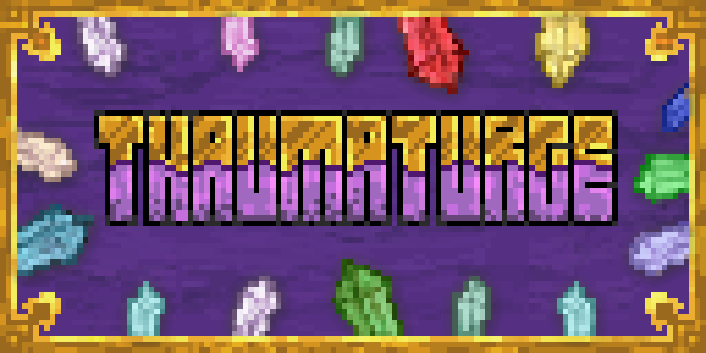

Thaumaturge is a comprehensive Minecraft magic mod that introduces a sophisticated magic system inspired by Thaumcraft, with unique mechanics centered around magical aspects, resonance gauntlets, and intricate spellcrafting.

## Features

### Core Magic System
- **Aspect-Based Magic**: 37 magical aspects organized in a hierarchical structure (Primal → Secondary → Tertiary → Quaternary)
- **Resonance Mechanics**: Aspects interact through amplification, opposition, and neutralization
- **Foci & Gauntlets**:
    - Three tiers of foci (Lesser, Advanced, Greater) for different targeting types
    - Gauntlets with increasing capacity (1-3 foci slots)
- **Spellcrafting**: Combine foci in gauntlets to create complex spells based on:
    - Aspect combinations
    - Resonance modifiers
    - Foci tiers

### Unique Mechanics
- **Quintessence & Aether**: Fundamental magical energy and its physical manifestation
- **Consequences System**: Magic use has physiological effects and can create "Dead Zones"
- **Material System**:
    - Aspect Cluster Shards (found in specific biomes)
    - Quicksilver (for lenses)
    - Runic Ingots (for magical equipment)
- **Multiple Practitioner Types**:
   - Thaumaturges
   - Archmages
   - Wizards
   - Witches
   - Mages
   - Sorcerers

### Visual & Auditory
- **Aetheric Goggles**: See aspects in the world
- **Aspect Lenses**: Examine items for their aspects
- **Custom Particles & Sounds**: Unique effects for different aspects

## Getting Started

### Installation
1. Install [Fabric Loader](https://fabricmc.net/) for Minecraft 1.21.5
2. Download the latest Thaumaturge jar from [Releases]()
3. Place in your `mods` folder

### Basic Usage
1. **Gather Aspect Shards**: Find primal aspect clusters in appropriate biomes
2. **Craft Basic Equipment**:
    - Basic Casting Gauntlet
    - Aspect Lens
3. **Create Foci**: Use alchemical processes to imbue foci with aspects
4. **Combine Foci**: Experiment with different aspect combinations in your gauntlet

## Spellcrafting System

### Aspect Effects
| Aspect      | Effect                                  |
|-------------|-----------------------------------------|
| Potentia    | Shoots bolts with 16-block range        |
| Alkimia     | Creates effect clouds                   |
| Ignis       | Deals fire damage, ignites targets      |
| Permutatio  | Swaps actor and target context          |
| Alienis     | Teleportation                           |
| ...         | ...                                     |

### Resonance Modifiers
- **Scatter**: Splits trajectories into multiple projectiles
- **Power**: Increases spell potency/damage
- **Simple**: No additional effect (stabilizes foci)

### Example Spell Combination
**Ignis** + **Potentia** + **Alkimia** with Scatter modifier:
- Shoots multiple bolts that create fire clouds on impact

## Materials & Crafting

### Key Materials
- **Aspect Shards**: Found in specific biomes (e.g., Ignis near volcanoes)
- **Quicksilver**: Used for crafting Aspect Lenses
- **Runic Bronze**: For gauntlet frames and protective equipment

### Crafting Stations
- **Vessel**: Alchemical workstation similar to cauldron
- **Arcane Infusion Chamber**: For creating higher-tier aspects

## Configuration

Thaumaturge includes a configuration system accessible through Mod Menu:
- Toggle always showing aspects in tooltips
- Adjust aspect decay rates
- Modify backlash thresholds

## Known Issues
- Some tertiary aspects not fully implemented
- Dead Zone mechanics need balancing
- Advanced spell combinations may cause client-side lag

## Planned Features
- Additional practitioner types (Archmages, Sorcerers)
- Quintessence manipulation mechanics
- Expanded branch interactions (Technomagic + Cosmic)
- More world generation features

## Contributing
Contributions are welcome! Please follow these guidelines:
1. Fork the repository
2. Create a new branch for your feature
3. Submit a pull request with detailed description

## License
Thaumaturge is under a custom [License](LICENSE)

## Support
For support, bug reports, or feature requests:
- [Issue Tracker](https://github.com/0vergrown/Thaumaturge/issues) <!-- Add your issue tracker link -->
- [Discord Server]()
- [CurseForge Page]()
- [Modrinth Page]()
- [Planet Minecraft Page]()